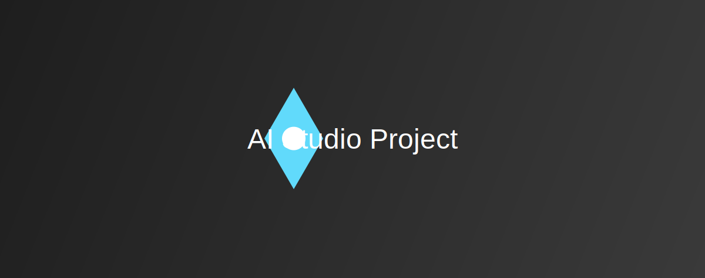

<div align="center">
  
</div>

# AI Studio Project

This project is a web application that leverages the power of the Gemini API to provide intelligent features. It's designed to be a starting point for building your own AI-powered applications.

## ✨ Features

- **AI-Powered:** Integrates with the Gemini API for advanced AI capabilities.
- **Modern Tech Stack:** Built with React, TypeScript, and Vite for a fast and efficient development experience.
- **Easy to Run:** Simple setup and execution process.

## 🚀 Getting Started

Follow these instructions to get a copy of the project up and running on your local machine for development and testing purposes.

### Prerequisites

- [Node.js](https://nodejs.org/) (v14 or later)
- [npm](https://www.npmjs.com/)

### Installation

1.  **Clone the repository:**
    ```sh
    git clone https://github.com/your-username/your-repository.git
    cd your-repository
    ```
2.  **Install dependencies:**
    ```sh
    npm install
    ```
3.  **Set up your environment variables:**
    Create a `.env.local` file in the root of your project and add your Gemini API key:
    ```
    GEMINI_API_KEY=your_gemini_api_key
    ```

### Running the application

```sh
npm run dev
```

The application will be available at `http://localhost:3000`.

## 💻 Technologies Used

- [React](https://reactjs.org/)
- [TypeScript](https://www.typescriptlang.org/)
- [Vite](https://vitejs.dev/)
- [Gemini API](https://ai.google.dev/)

## 🔗 Links

- **View your app in AI Studio:** [AI Studio](https://aistudio.google.com/apps/drive/1KzXD6AqI8hbVeVhX0CWN6rJvNoDZ79e6?showPreview=true)
